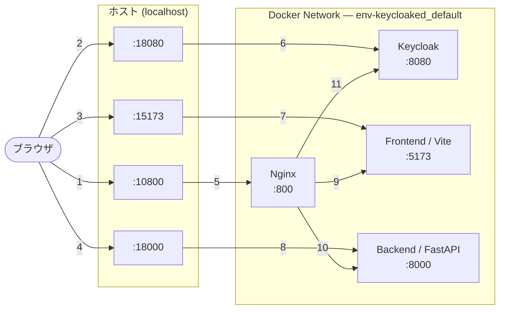

# env-keycloaked

開発初期向けの認証付きWebアプリテンプレートです。

- Reverse Proxy: Nginx
- 認証: Keycloak
- フロントエンド: React + Vite (TypeScript)
- バックエンド: FastAPI (Swagger UI 利用可)

## ポート設計

内部ポートに対して、公開ポートは `+10000` した番号を採用しています。

| Service | 内部 | 公開（既定） |
| --- | ---: | ---: |
| Reverse Proxy (Nginx) | 800 | 10800 |
| Keycloak | 8080 | 18080 |
| Frontend (Vite) | 5173 | 15173 |
| Backend (FastAPI) | 8000 | 18000 |

### ネットワーク構成



## 起動

Docker Compose は Dev Container の外側、WSL2 側のリポジトリディレクトリで実行してください。Dev Container 内から実行すると、bind mount の基準パスが Docker daemon 側で解決できず、空ディレクトリがマウントされることがあります。

```bash
docker compose up --build
```

### ポート衝突時

公開ポートが使用中の場合は、該当ポートを環境変数で変更できます。

```bash
BACKEND_HOST_PORT=18001 docker compose up -d --build
```

複数のポートが衝突している場合は、同時に指定してください。

```bash
BACKEND_HOST_PORT=18001 FRONTEND_HOST_PORT=15174 docker compose up -d --build
```

利用できる環境変数は `REVERSE_PROXY_HOST_PORT`, `KEYCLOAK_HOST_PORT`, `FRONTEND_HOST_PORT`, `BACKEND_HOST_PORT` です。

## アクセス

### Reverse Proxy 経由

- Frontend: http://localhost:10800/
- Keycloak: http://localhost:10800/auth/
- Backend API: http://localhost:10800/api/health
- Backend Swagger: http://localhost:10800/api/docs

### 直アクセス（開発初期向け）

- Keycloak: http://localhost:18080/auth/
- Frontend: http://localhost:15173/
- Backend API: http://localhost:18000/health
- Backend Swagger: http://localhost:18000/docs

## VS Code Dev Container

`.devcontainer/devcontainer.json` を用意済みです。
VS Code で **Reopen in Container** すると Node.js/Python/Docker CLI を使った開発環境が立ち上がります。
アプリ一式の `docker compose up` は WSL2 側で実行してください。
