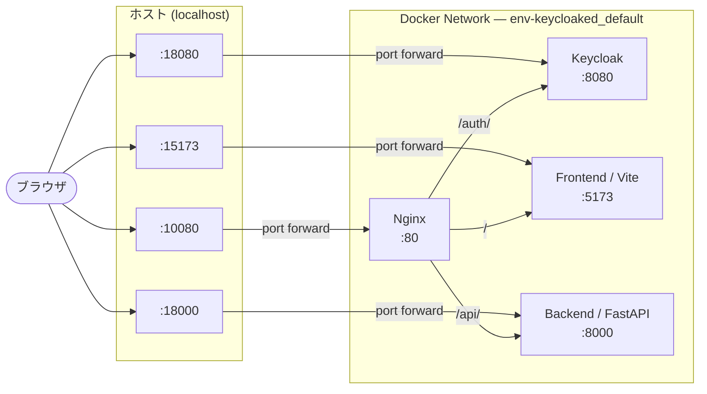

# env-keycloaked

開発初期向けの認証付きWebアプリテンプレートです。

- Reverse Proxy: Nginx
- 認証: Keycloak
- フロントエンド: React + Vite (TypeScript)
- バックエンド: FastAPI (Swagger UI 利用可)

## ポート設計

内部ポートに対して、公開ポートは `+10000` した番号を採用しています。

| Service | 内部 | 公開 |
| --- | ---: | ---: |
| Reverse Proxy (Nginx) | 80 | 10080 |
| Keycloak | 8080 | 18080 |
| Frontend (Vite) | 5173 | 15173 |
| Backend (FastAPI) | 8000 | 18000 |

### ネットワーク構成



## 起動

```bash
docker compose up --build
```

## アクセス

### Reverse Proxy 経由

- Frontend: http://localhost:10080/
- Keycloak: http://localhost:10080/auth/
- Backend API: http://localhost:10080/api/health
- Backend Swagger: http://localhost:10080/api/docs

### 直アクセス（開発初期向け）

- Keycloak: http://localhost:18080/auth/
- Frontend: http://localhost:15173/
- Backend API: http://localhost:18000/health
- Backend Swagger: http://localhost:18000/docs

## VS Code Dev Container

`.devcontainer/devcontainer.json` を用意済みです。
VS Code で **Reopen in Container** すると Node.js/Python/Docker CLI を使った開発環境が立ち上がります。
