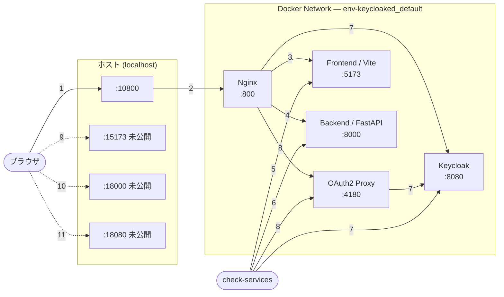

# env-keycloaked

開発初期向けの認証付きWebアプリテンプレートです。

- Reverse Proxy: Nginx
- 認証: Keycloak + OAuth2 Proxy
- フロントエンド: React + Vite (TypeScript)
- バックエンド: FastAPI (Swagger UI 利用可)

## ポート設計

ブラウザから直接到達できる公開ポートは Reverse Proxy のみです。Frontend, Backend, Keycloak は Docker 内部ネットワークに閉じ、Nginx と OAuth2 Proxy を経由して利用します。

| Service | 内部 | 公開（既定） |
| --- | ---: | ---: |
| Reverse Proxy (Nginx) | 800 | 10800 |
| OAuth2 Proxy | 4180 | 未公開 |
| Keycloak | 8080 | 未公開 |
| Frontend (Vite) | 5173 | 未公開 |
| Backend (FastAPI) | 8000 | 未公開 |

### ネットワーク構成



## 起動

Docker Compose は Dev Container の外側、WSL2 側のリポジトリディレクトリで実行してください。Dev Container 内から実行すると、bind mount の基準パスが Docker daemon 側で解決できず、空ディレクトリがマウントされることがあります。

```bash
docker compose up --build
```

### ポート衝突時

公開ポートが使用中の場合は、Reverse Proxy の公開ポートを環境変数で変更できます。

```bash
REVERSE_PROXY_HOST_PORT=10801 docker compose up -d --build
```

OAuth2 のリダイレクト先は開発用に `http://localhost:10800` を既定にしています。公開ポートを変える場合は OAuth2 Proxy と Keycloak client のリダイレクト設定も合わせて変更してください。

## 認証

初回アクセス時は Keycloak のログイン画面へリダイレクトされます。開発用のユーザーは次の通りです。

```bash
admin / admin
```

アプリケーション用の OAuth2 認証は `env-keycloaked` realm を使用します。Keycloak 管理画面は Keycloak の管理者ログインとして扱われますが、開発用の初期ユーザーはいずれも `admin / admin` です。

## アクセス

### 認証後のアクセス

ブラウザから利用する入口は Reverse Proxy の `http://localhost:10800` のみです。未認証の場合は Keycloak のログイン画面へリダイレクトされ、認証後に元の URL へ戻ります。

- Frontend: http://localhost:10800/
- Backend Swagger: http://localhost:10800/api/docs
- Keycloak 管理画面: http://localhost:10800/auth/admin/

Keycloak 管理画面にログインすると、通常は `http://localhost:10800/auth/admin/master/console/` へ遷移します。

### Keycloak 関連 URL

- OAuth2 ログイン realm: http://localhost:10800/auth/realms/env-keycloaked
- Keycloak 管理画面: http://localhost:10800/auth/admin/

### 直アクセス

Frontend, Backend, Keycloak のホスト直アクセス用ポートは公開していません。次の URL にブラウザから直接アクセスできないことが期待値です。

- Frontend: http://localhost:15173/
- Backend Swagger: http://localhost:18000/docs
- Keycloak: http://localhost:18080/auth/

`check-services.sh` では、内部ネットワークで各サービスが疎通できること、Reverse Proxy 経由の未認証アクセスが OAuth2 ログインへ誘導されること、旧直アクセス用の `15173`, `18000`, `18080` に到達できないことを確認します。

## VS Code Dev Container

`.devcontainer/devcontainer.json` を用意済みです。
VS Code で **Reopen in Container** すると Node.js/Python/Docker CLI を使った開発環境が立ち上がります。
アプリ一式の `docker compose up` は WSL2 側で実行してください。
